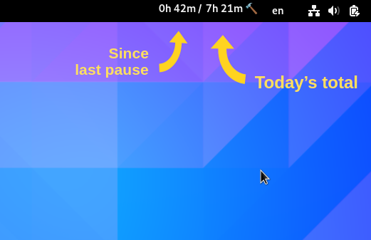

# Typer-Timer: Clock Your Keyboard Usage

Typer-Timer is a GNOME extension for Linux that clocks your computer usage thoughout the day. Typing on your keyboard will keep the timer running. If there's no keyboard activity for 5 minutes, the timer resets. It also provides a "daily total" summarizing your keyboard usage.



## Potential Use Cases

* Become aware of time sinks like "mindless browsing"
* Reminder for taking breaks to avoid Repetitive Strain Injuries (RSI)
* [Pomodoro](https://en.wikipedia.org/wiki/Pomodoro_Technique)-like time management; no need to to manually set a timer

Many other tools flood users with disruptive notifications, demanding you to take breaks.
Typer-Timer, on the other hand, acts as a passive timer.
It leaves **you** responsible for when and how frequently to take breaks.

# Requirements

* GNOME. See supported versions in [metadata.json](gnome-extension/metadata.json). Versions not listed might also work by executing `gsettings set org.gnome.shell disable-extension-version-validation true`.
* X11 (Wayland not yet supported)
* Docker or Podman for building, or follow the steps manually in [Dockerfile](Dockerfile) for installing Rust and X11 headers on your host

# Build and Run

```bash
cd typer-timer

# Build keyboard detector
docker build --target build --tag typer-timer .
docker run --volume $(pwd):/workspaces/typer-timer:rw typer-timer \
    cargo build --release

# Install GNOME extension
ln --symbolic \
    $(realpath ./gnome-extension) \
    "~/.local/share/gnome-shell/extensions/typer-timer@hadar.gr"

# Start keyboard detector
./target/release/typer-timer

# USER ACTION:
#     Start GNOME extention. In X11 window manager, type "Alt + F2" and
#     enter "restart" in the displayed command prompt.
```
